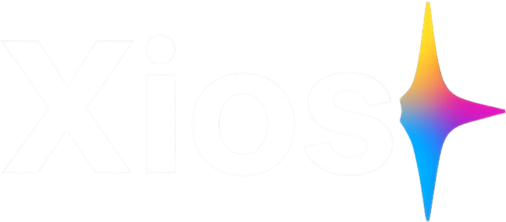

<div align="center">
  
  <h1>Xios.dev</h1>
  <p><strong>A robust, Free & Open Source (FOSS) asset manager and infinite canvas moodboard.</strong></p>
  <p><i>Built by Artists, for Artists. Free to Use, Like WinRAR.</i></p>
</div>

<br />

Welcome to **Xios.dev** — the privacy-first, lightning-fast, AI-powered local asset manager and spatial workspace. 

We grew tired of relying on cloud subscriptions, having our private references data-harvested, and dealing with clunky, sluggish interfaces when managing thousands of assets. Xios was built from the ground up to solve these exact problems. Powered by a highly optimized Rust backend and a sleek, hardware-accelerated React frontend, Xios brings enterprise-grade performance and cutting-edge local AI tools directly to your machine.

---

## Core Philosophy

Creative professionals deal with thousands of reference images, documents, and 3D models. The current industry standard is to upload these to a cloud service, subjecting your private reference materials to potential data mining, compression, and subscription paywalls. 

Xios is built on three core pillars:
1. **Absolute Privacy**: Everything is stored locally on your hard drive. Your data never leaves your machine.
2. **Spatial Organization**: Folders are rigid. The human brain works spatially. We combine traditional library management with infinite canvas moodboards.
3. **Local Intelligence**: AI tools should assist you without requiring an API key or an internet connection. 

---

## Feature Audit: The Xios Ecosystem

Xios is fundamentally split into two halves that work in perfect harmony: the Asset Library and the Infinite Canvas. 

### Unrivaled Organization & Vaults
- **Isolated Vaults**: Keep your client work and personal projects in completely isolated workspaces stored securely as local SQLite databases.
- **Virtualized Gallery**: Xios uses advanced list virtualization to let you effortlessly scroll through libraries containing tens of thousands of items with zero lag.
- **Deep Metadata**: Assign Tags, Collections, and Markdown Notes to any asset. Group reference material with precision.
- **Auto-Watch Folders**: Drop files into your OS folder, and Xios instantly ingests, processes, and generates thumbnails in the background.

### The Infinite Canvas
- **Spatial Workspaces**: Drag and drop images directly from your library onto an infinite canvas. 
- **Rich Nodes**: Support for sticky notes, text blocks, geometric shapes, directional arrows, and bounding sections to organize your thoughts.
- **Real-Time Integration**: Edits made to an image in the Studio Tools are automatically and instantly reflected on the canvas. 
- **Precise Controls**: Pixel-perfect resizing, aspect-ratio locking, and Z-index layering controls.

### Local AI Studio
All AI models run completely offline on your machine using hardware acceleration—no APIs, no subscriptions, no data harvesting.
- **Background Removal**: Instantly isolate subjects from complex backgrounds using WebAssembly neural networks.
- **Image Upscaling**: Double the resolution of low-quality references or sketches using our baked-in ESRGAN model.
- **Studio Adjustments**: Natively adjust brightness, contrast, saturation, and blur without needing to open external photo editing software.

### Advanced Media Viewers
- **PDF Powerhouse**: Read PDFs in a 3D Flipbook view, utilize continuous scroll, perform global text searches, and extract images via bounding-box cropping.
- **OCR Text Extraction**: Extract text from scanned PDFs or specific cropped regions using local Tesseract optical character recognition.
- **3D Model Viewer**: Natively spin and inspect `.obj` and `.glb` files right in your library.
- **Markdown Editor**: Write robust text notes directly in the app to accompany your visual references.

---

## The Landscape: Xios vs. Pinterest vs. Cosmos.so

The asset management and moodboard space is dominated by cloud-first platforms. Here is how Xios rethinks the paradigm compared to Pinterest and Cosmos.so:

### Pinterest
Pinterest popularized the concept of digital moodboards, but it is fundamentally a social media advertising platform, not a professional tool.
- **The Problem**: It is cloud-only, heavily monetized through advertisements, and actively mines your data to feed its recommendation algorithm. Boards are rigid, grid-based, and cannot be organized spatially.
- **The Xios Difference**: Xios operates 100% offline. There are no algorithms, no advertisements, and no tracking. Furthermore, Xios provides an infinite spatial canvas, allowing you to arrange assets in clusters, scale them by importance, and draw connections, rather than forcing them into a strict vertical grid.

### Cosmos.so
Cosmos is a beautiful, aesthetic-focused alternative for creatives, but it remains heavily constrained by its SaaS architecture.
- **The Problem**: Cosmos relies on a cloud subscription model. Your assets live on their servers, which means you are renting access to your own moodboards. AI auto-tagging occurs on their backend, requiring an internet connection.
- **The Xios Difference**: Xios brings the premium, high-aesthetic UI experience of Cosmos but runs it entirely on bare metal. You own the software and you own your files. The AI background removal and upscaling models run on your own GPU/CPU, ensuring you can work on a plane, in a cabin, or completely off the grid without losing functionality.

| Feature | Xios | Pinterest | Cosmos.so |
|---------|:---:|:---:|:---:|
| **Architecture** | Local / Offline-First | Cloud (SaaS) | Cloud (SaaS) |
| **Monetization** | Free & Open Source | Advertisements / Data Mining | Monthly Subscription |
| **Board Layout** | Infinite Spatial Canvas | Rigid Vertical Grid | Rigid Grid / Local |
| **Privacy** | Absolute | None | Policy Dependent |
| **AI Features** | Local Upscaling, BG Removal | Algorithmic Feed | Cloud-based Auto-tagging |
| **File Support** | Images, PDFs, 3D, Markdown | Images, Videos | Images, Links, Text |

---

## Build Xios from Scratch (Developer Tutorial)

Want to contribute or build Xios for yourself? It is incredibly easy. Xios uses Tauri, so you will need both Node.js and Rust installed on your system.

### Prerequisites
1. **Node.js** (v18 or higher) - Download from the official Node.js website.
2. **Rust** - Install via rustup.
3. **C++ Build Tools** (Windows only) - Install the "Desktop development with C++" workload via the Visual Studio Installer.

### 1. Clone the Repository
```bash
git clone https://github.com/your-username/xios.git
cd xios
```

### 2. Install Frontend Dependencies
```bash
npm install
```

### 3. Run in Development Mode
This will start the Vite development server and the Tauri Rust backend simultaneously.
```bash
npm run tauri:dev
```
*Note: The first time you run this, Cargo (Rust) will take a few minutes to download and compile the backend crates.*

### 4. Build a Production Release
Ready to package Xios into a standalone executable installer?
```bash
npm run tauri:build
```
Once finished, your compiled installer will be located in `src-tauri/target/release/bundle/`.

---

<div align="center">
  <i>Xios.dev - Built by Artists, for Artists.</i>
</div>
