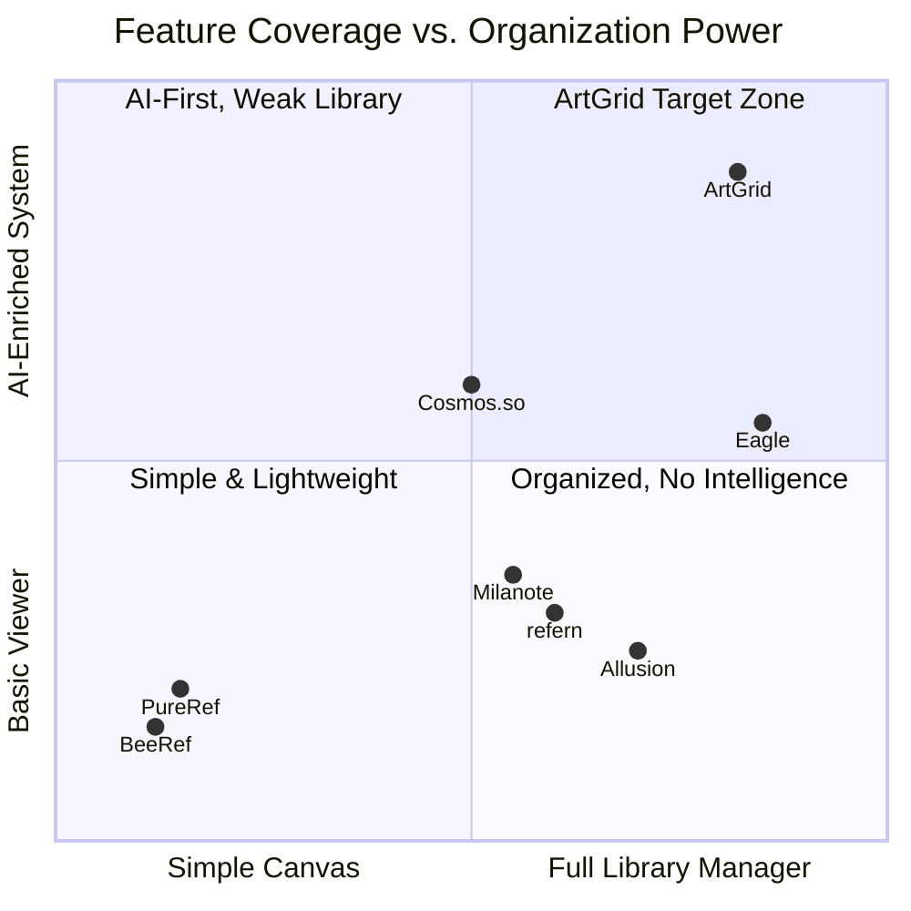
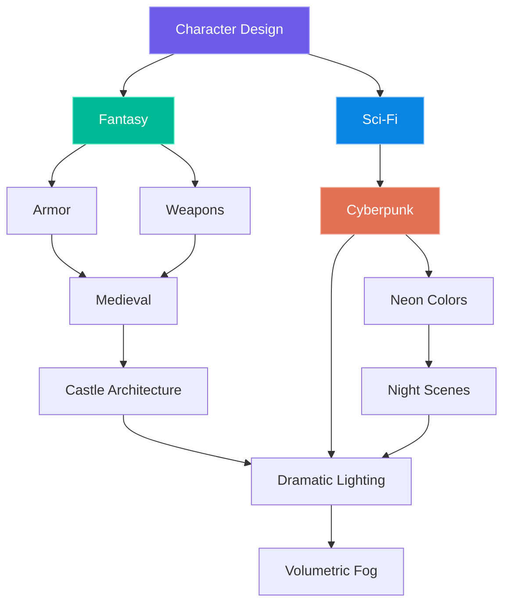
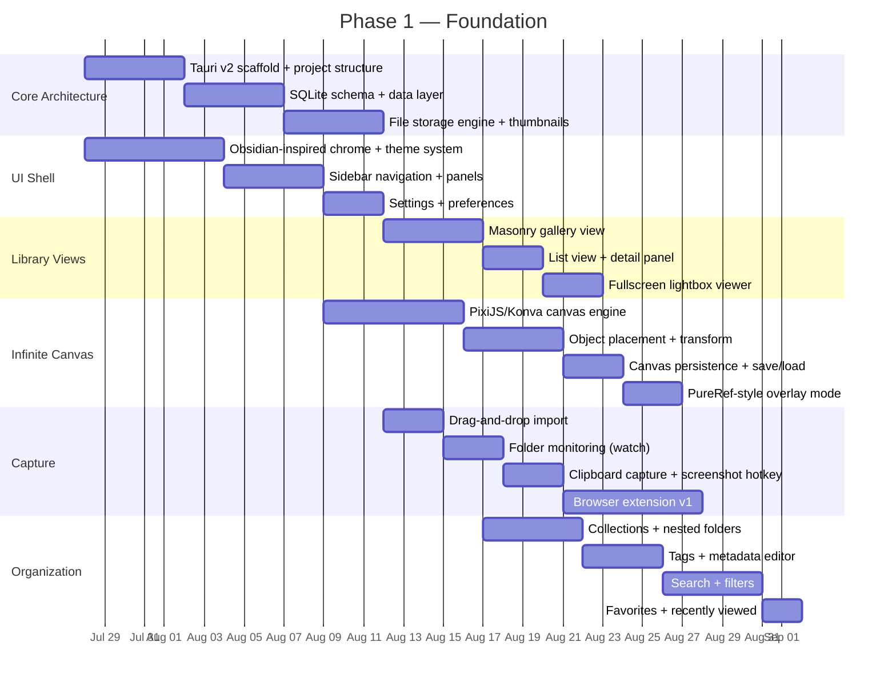

# ArtGrid — Feature Specification & Roadmap

> **Local-First Creative Reference Manager**
> A self-hosted application for inspiration capture, mood boarding, visual knowledge management, and AI-powered asset enrichment — built for artists, designers, and creative professionals.

---

## Market Context & Strategic Position

### The Problem

Artists and designers in 2026 face a fragmented workflow:

| Pain Point | What Happens |
|:---|:---|
| **Scattered references** | Images spread across Pinterest, Instagram, local drives, phone screenshots, and browser bookmarks |
| **Two-tool tax** | Professionals use Eagle/Allusion for _storage_ and PureRef/BeeRef for _viewing_ — no single tool does both well |
| **AI slop pollution** | Pinterest and social platforms are saturated with AI-generated content, making authentic reference discovery harder |
| **No intelligent recall** | Thousands of saved images become unsearchable without manual tagging discipline |
| **Workflow friction** | Constant alt-tabbing between browser → save → organize → reference board breaks creative flow |
| **Cloud dependency** | Most modern tools (Milanote, Cosmos.so) require accounts, subscriptions, and internet — artists want local ownership |

### Competitive Landscape



> [!IMPORTANT]
> **ArtGrid's strategic position**: The only tool that combines a full PureRef-class infinite canvas with Eagle-class library management AND local AI enrichment — all without requiring cloud accounts, subscriptions, or internet access.

### What ArtGrid Must Beat

| Competitor | What They Do Best | What ArtGrid Must Match or Exceed |
|:---|:---|:---|
| **PureRef** | Always-on-top overlay, zero-friction canvas | Canvas speed, overlay mode, drag-and-drop fluidity |
| **Eagle** | Browser extension, massive library management, smart folders | Capture speed, tagging depth, search performance at 100k+ assets |
| **Obsidian Canvas** | Bi-directional linking, markdown integration, plugin ecosystem | Graph-based knowledge connections, extensibility, note-taking quality |
| **Cosmos.so** | AI-powered visual search, aesthetic curation, community | Semantic search quality, visual similarity, color-based discovery |
| **Allusion** | Open-source, local-first, lightweight | Privacy, performance, zero-cost core |

---

## Technology Stack (Recommended)

| Layer | Technology | Rationale |
|:---|:---|:---|
| **Desktop Framework** | **Tauri v2** (Rust backend) | 5–10× lighter than Electron, native OS integration, GPU access, secure file system APIs |
| **Frontend** | **React** + **TypeScript** | Ecosystem maturity, component libraries, Konva.js/PixiJS integration |
| **Canvas Engine** | **PixiJS** (WebGL) with **Konva.js** (interaction layer) | GPU-accelerated rendering for 1000+ objects; Konva handles hit detection and drag events |
| **Database** | **SQLite** (primary) + **sqlite-vec** (vector search) | Local-first, zero-config, embedded vector search for semantic queries |
| **AI Runtime** | **Ollama** sidecar (CLIP, BLIP-2, LLaVA) | Local inference, no cloud dependency, model-agnostic |
| **Metadata** | **ExifTool** via Rust `std::process::Command` | Industry-standard EXIF/IPTC/XMP read/write |
| **Thumbnail Engine** | Rust `image` crate + `ffmpeg` sidecar | Fast, parallel thumbnail generation for images and video |
| **Search** | **Tantivy** (Rust full-text search) + SQLite FTS5 | Sub-millisecond keyword search at scale |
| **Deployment** | Native installers + **Docker** (self-hosted option) | Desktop-first with optional server mode for NAS/team use |

---

## Feature Specification

### 1. Capture

> The capture process must be frictionless. Anything savable within seconds.

#### 1.1 Web Capture — Browser Extension (Chrome, Firefox, Edge)

| Capability | Details |
|:---|:---|
| Save entire webpage | Full-page archive with snapshot |
| Save selected images | Right-click or hover overlay to capture |
| Save text snippets | Highlight → save with source attribution |
| Save screenshots | Visible area or full-page scroll capture |
| Save videos | Metadata + link + embedded thumbnail |
| Save PDFs | Download and index inline |
| Save social media posts | Twitter/X, Instagram, Bluesky, Threads — preserve post context |
| Save GitHub repositories | README preview, metadata, star count |
| Save code snippets | Syntax-highlighted blocks with language detection |
| **Metadata preserved** | Original URL, page title, author, favicon, preview image, archive timestamp |

> [!TIP]
> **Market insight**: Eagle's browser extension is the single most-cited reason users choose it. ArtGrid's extension must match its one-click speed and add intelligent auto-tagging on capture — something Eagle only recently added.

#### 1.2 Local Capture

| Capability | Details |
|:---|:---|
| Drag & drop | Files, folders, or images from any application |
| Watch folders | Monitor designated directories for automatic imports |
| Bulk import | Recursive directory scanning with progress tracking |
| Camera import | Detect connected cameras via MTP/PTP |
| Scanner support | TWAIN/WIA scanner integration |
| Clipboard monitoring | Optional persistent clipboard watcher for images and text |
| Screenshot hotkey | Global system hotkey (configurable) for region/window/fullscreen capture |

#### 1.3 Mobile Capture (Phase 3+)

| Capability | Details |
|:---|:---|
| Share sheet | Native OS share target on iOS/Android |
| Camera upload | Direct-to-library photo capture |
| Voice notes | Audio recording with optional transcription |
| Quick capture widget | Home screen widget for instant save |

---

### 2. Library Management

#### 2.1 Collections & Hierarchy

| Feature | Description |
|:---|:---|
| Collections | User-defined groupings of assets |
| Nested collections | Unlimited depth folder hierarchy |
| Smart collections | Auto-populated by filter rules (e.g., "all PNGs tagged 'armor' added this month") |
| Favorites | Quick-access starred items |
| Archive | Soft-delete without permanent removal |
| Recently viewed | Chronological access history |
| Trash | Recoverable deleted items with configurable retention |

#### 2.2 Organization Taxonomy

| Axis | Options |
|:---|:---|
| **Tags** | Freeform, unlimited, hierarchical (e.g., `anatomy/hands/gesture`) |
| **Categories** | Predefined buckets (Character, Environment, Prop, UI, Typography, etc.) |
| **Labels** | Color-coded visual markers (🔴 Urgent, 🟡 Review, 🟢 Approved, 🔵 Reference, 🟣 Inspiration) |
| **Projects** | Group assets by creative project |
| **Clients** | Associate assets with client work |
| **Status** | Draft → In Progress → Review → Approved → Archived |
| **Priority** | Critical / High / Medium / Low / None |
| **Custom metadata** | User-defined key-value fields per asset or collection |

#### 2.3 Relationships & Graph

| Feature | Description |
|:---|:---|
| Related assets | Manual or AI-suggested "see also" links |
| Parent/child | Hierarchical asset relationships (e.g., sketch → final) |
| Connected inspiration | Link assets to the work they inspired |
| Visual graph | Interactive node graph showing asset connections (Obsidian-style) |
| Backlinks | Automatic reverse-link tracking ("What links to this?") |
| Cross-references | Assets can appear in multiple collections without duplication |

---

### 3. Supported Asset Types

#### 3.1 Images

| Format | Notes |
|:---|:---|
| JPG, PNG, GIF, WEBP, TIFF, HEIF | Standard raster formats |
| RAW (CR2, NEF, ARW, DNG, ORF, RAF) | Camera RAW with embedded preview extraction |
| PSD | Photoshop — layer-aware thumbnail generation |
| KRA | Krita native format |
| SVG | Vector — rendered preview + source viewing |
| AVIF, JXL | Next-gen formats |

#### 3.2 Video

| Format | Notes |
|:---|:---|
| MP4, MOV, WEBM, MKV, AVI | All major containers |
| **Auto-generated** | Thumbnails, animated previews (GIF/WEBM), timeline scrubbing strip |

#### 3.3 Documents

| Format | Notes |
|:---|:---|
| PDF | Page thumbnails, text extraction, annotation support |
| DOCX, ODT | Rendered preview |
| Markdown | Native rendering with live preview |
| TXT, RTF | Plain text with syntax detection |
| EPUB | Book-style reading view |

#### 3.4 Creative & 3D Files

| Format | Notes |
|:---|:---|
| Blender (.blend) | Thumbnail extraction |
| FBX, GLTF/GLB, OBJ, STL | 3D preview via embedded WebGL viewer |
| Figma exports | PNG/SVG import with metadata preservation |
| Illustrator (AI), InDesign (INDD) | Thumbnail + metadata extraction |
| XD exports | Design asset import |

---

### 4. AI Enrichment (Optional — Local AI via Ollama)

> All AI features are **opt-in** and run **entirely locally**. No data leaves the machine.

#### 4.1 Image Recognition

| Detection Target | Examples |
|:---|:---|
| Objects | Sword, chair, car, book, potion, lantern |
| Living things | Animals, faces, plants, creatures |
| Architecture | Castle, skyscraper, interior, ruins, bridge |
| Clothing | Armor, dress, cape, boots, helmet |
| Vehicles | Spaceship, horse, motorcycle, wagon |
| Nature | Forest, ocean, mountain, desert, sky |

#### 4.2 Artistic Analysis

| Attribute | Generated Values |
|:---|:---|
| Style | Photorealistic, cel-shaded, impressionist, pixel art, watercolor |
| Medium | Digital painting, photograph, 3D render, pencil sketch, oil paint |
| Perspective | Bird's eye, worm's eye, isometric, first-person, 3/4 view |
| Lighting | Rim light, volumetric, golden hour, harsh shadow, ambient occlusion |
| Mood / Emotion | Melancholic, triumphant, eerie, serene, chaotic |
| Composition | Rule of thirds, centered, diagonal, framing, leading lines |
| Shape language | Angular/aggressive, rounded/soft, geometric, organic |
| Camera angle | Close-up, wide shot, medium shot, over-the-shoulder |
| Depth | Shallow DOF, deep focus, atmospheric perspective |
| Subject | Portrait, landscape, still life, action scene, abstract |

#### 4.3 Color Analysis

| Feature | Output |
|:---|:---|
| Palette extraction | Top 5–8 colors as swatches |
| HEX / RGB / HSL values | Copy-ready color codes |
| Dominant color | Primary color classification |
| Contrast ratio | WCAG accessibility score |
| Brightness | Light / Medium / Dark classification |
| Temperature | Warm / Neutral / Cool |
| Color harmony | Complementary, analogous, triadic, split-complementary |

> [!TIP]
> **Market insight**: Color palette extraction is one of the top 3 most-requested features on Reddit art communities. Artists want to hover over any reference and instantly extract a usable palette for their painting software.

#### 4.4 OCR (Optical Character Recognition)

| Source | Capability |
|:---|:---|
| Images & screenshots | Text extraction with bounding boxes |
| Scanned books & PDFs | Full-page text recognition |
| Notes & whiteboards | Handwriting recognition (best-effort) |

#### 4.5 Caption & Tag Generation

| Output | Use Case |
|:---|:---|
| Natural language descriptions | "A medieval knight standing in a dimly lit stone corridor" |
| Alt text | Accessibility-compliant image descriptions |
| Search keywords | Auto-generated terms for search indexing |
| Smart tags | Hierarchical tags inferred from content |

---

### 5. Search

> A powerful search engine is the difference between a "folder of images" and a "creative knowledge base."

#### 5.1 Traditional Search

- Filename, tags, collections, metadata, dates, author, notes
- Boolean operators: `AND`, `OR`, `NOT`, parentheses grouping
- Saved searches with notification on new matches

#### 5.2 Semantic Search (AI-Powered)

Natural language queries that understand _meaning_, not just keywords:

```
"rainy cyberpunk street at night"
"warm wooden cabin interior with fireplace"
"fantasy plate armor with gold trim"
"minimalist geometric logo in blue tones"
"dramatic rim lighting on a portrait"
```

> No manual tagging required. Powered by CLIP embeddings stored in `sqlite-vec`.

#### 5.3 Visual Search

| Mode | Description |
|:---|:---|
| Similar images | "Find more like this" — based on visual embedding distance |
| Similar colors | Match by dominant palette |
| Similar composition | Find images with matching layout structure |
| Similar lighting | Match by lighting classification |
| Reverse image search | Paste/upload an external image to find matches in your library |

#### 5.4 Advanced Filters

| Filter | Options |
|:---|:---|
| File type | Image, Video, Document, 3D, Audio |
| Size | File size ranges |
| Resolution | Minimum width/height, megapixel ranges |
| Orientation | Landscape, Portrait, Square, Panoramic |
| Aspect ratio | 16:9, 4:3, 1:1, 3:2, custom |
| Camera / Lens | EXIF-extracted metadata |
| License | Creative Commons, Public Domain, All Rights Reserved, Unknown |
| Date | Created, imported, modified — with range picker |
| Rating | 1–5 stars |
| Color | Dominant color picker / HEX input |

---

### 6. Annotation

> Every asset should support rich, layered notes.

| Tool | Description |
|:---|:---|
| Text notes | Rich-text notes attached to any asset |
| Sticky notes | Positioned annotations overlaid on images |
| Highlights | Color-coded region highlighting |
| Arrows & lines | Directional callouts |
| Circles & boxes | Region-of-interest markers |
| Freehand drawing | Pen/brush tool for sketching over references |
| Measurements | Pixel/proportional measurement tool |
| Callouts | Numbered or labeled callout bubbles |
| Markdown notes | Full markdown editor per asset |

---

### 7. Mood Boards — Infinite Canvas

> The creative workspace where references become compositions.

#### 7.1 Canvas Features

| Feature | Description |
|:---|:---|
| Infinite canvas | Unlimited pan/zoom workspace (WebGL-accelerated) |
| Freeform placement | Drag anywhere — no grid constraints by default |
| Resize & rotate | Per-object transform controls |
| Snap to grid | Optional alignment grid (toggle on/off) |
| Snap to objects | Smart alignment guides when dragging near other objects |
| Layers | Z-order management, lock/unlock, show/hide |
| Background | Solid color, gradient, image, or transparent |
| Templates | Pre-built mood board layouts (grid, masonry, freeform, comparison) |
| Nesting | Embed boards within boards (Obsidian Canvas-style) |
| Overlay mode | Always-on-top floating window (PureRef-style) |
| Minimap | Birds-eye navigation for large boards |

#### 7.2 Canvas Objects

| Object | Capability |
|:---|:---|
| Images | From library or external drag-and-drop |
| Notes | Rich text cards with markdown support |
| Videos | Inline playback with scrubbing |
| PDFs | Page-by-page embedded viewing |
| Links | Web link cards with preview thumbnail |
| Color palettes | Extracted or manually created swatch strips |
| Shapes | Rectangle, circle, line, arrow, polygon |
| Icons | Built-in icon library for visual markers |
| Text labels | Standalone typography elements |
| Frames / groups | Named containers to organize board regions |

> [!IMPORTANT]
> **The mood board canvas is ArtGrid's flagship differentiator.** It must feel as fast as PureRef while offering the richness of Obsidian Canvas. This is the first feature users will judge the app by.

---

### 8. Comparison Tools

> Critical for artists studying reference material.

| Mode | Description |
|:---|:---|
| Side-by-side | Two or more images shown adjacently with synced zoom |
| Overlay | Stack images with adjustable opacity (0–100%) |
| Split slider | Draggable divider to reveal/compare two images |
| Synced zoom | Zoom and pan are mirrored across compared images |
| Synced pan | Scroll position locks across panels |
| Difference highlighting | Pixel-diff overlay showing changes between versions |
| Lightbox | Fullscreen single-image view with swipe navigation |

---

### 9. Inspiration Graph

> Beyond folders — a visual knowledge web.



| Feature | Description |
|:---|:---|
| Interactive node graph | Zoom, pan, click-to-navigate |
| Auto-generated connections | AI suggests links based on visual/semantic similarity |
| Manual connections | User-drawn links between any two assets |
| Cluster detection | AI groups related assets into visual neighborhoods |
| Tag-based graph | View the relationship web of your tag taxonomy |
| Traversal | Click through the graph to explore adjacent inspiration |

---

### 10. Metadata Management

> Automatically captured and stored for every asset.

| Field | Source |
|:---|:---|
| Original URL | Browser extension / import |
| Archived URL | Local snapshot path |
| Artist / Creator | Extracted from page metadata or manually entered |
| Copyright & License | Parsed from EXIF/IPTC or user-assigned |
| Creation date | EXIF `DateTimeOriginal` or file creation date |
| Import date | Timestamp of ingestion into ArtGrid |
| Modified date | Last edit timestamp |
| Resolution | Width × Height in pixels |
| Camera & Lens | EXIF extraction for photos |
| Full EXIF dump | Expandable metadata inspector panel |
| File hash (SHA-256) | For deduplication and integrity verification |
| Custom fields | User-defined key-value pairs |

---

### 11. Duplicate Detection

| Detection Level | Method |
|:---|:---|
| Exact duplicates | SHA-256 hash comparison |
| Near duplicates | Perceptual hash (pHash/dHash) with configurable threshold |
| Cropped variants | Feature-point matching (SIFT/ORB) |
| Resized variants | Normalized perceptual hash comparison |
| Recompressed variants | Fuzzy hash matching across quality levels |

**Actions**: Suggest merge → keep highest quality → link as variants → bulk resolve.

---

### 12. Version History

| Feature | Description |
|:---|:---|
| Metadata versioning | Track all tag, note, and collection changes over time |
| Note history | Full revision history for annotations and notes |
| Tag history | See when tags were added/removed |
| Collection history | Track membership changes |
| Restore | Roll back any asset to a previous state |
| Diff view | Side-by-side comparison of metadata versions |

> Git-inspired. Every change is tracked. Nothing is lost.

---

### 13. File Storage

> Never require cloud storage. Always respect user sovereignty.

| Backend | Support |
|:---|:---|
| Local filesystem | Default — files stored in user-chosen directory |
| NAS | Network-attached storage via SMB/NFS |
| External drives | USB/Thunderbolt with safe eject handling |
| S3-compatible | MinIO, Backblaze B2, Wasabi, AWS S3 |
| Network shares | UNC paths / mapped drives |

| Storage Feature | Description |
|:---|:---|
| Non-destructive | Originals are never modified — edits stored as sidecar data |
| Portable library | Entire library is a folder — copy it anywhere and it works |
| Configurable paths | Choose where originals, thumbnails, and database live separately |

---

### 14. Collaboration (Optional — Phase 4+)

| Feature | Description |
|:---|:---|
| Shared libraries | Multiple users access the same library (read/write or read-only) |
| Shared mood boards | Collaborative canvas editing |
| Comments | Per-asset threaded discussions |
| Mentions | @user notifications |
| Permissions | Role-based access (Admin, Editor, Viewer) |
| Read-only mode | Share a board without allowing edits |
| Approval workflow | Submit → Review → Approve/Reject pipeline |

---

### 15. Plugin System

> Extensibility is a core architectural principle.

| Plugin Type | Examples |
|:---|:---|
| AI models | Swap CLIP for SigLIP, add custom classifiers |
| Importers | Pinterest board importer, Behance importer, ArtStation scraper |
| Exporters | Export to Notion, Google Drive, custom formats |
| Themes | Custom UI themes, color schemes, layouts |
| OCR engines | Tesseract, PaddleOCR, Apple Vision |
| Automation | Custom workflow scripts |
| Canvas extensions | New object types, drawing tools, layout algorithms |

**Plugin API**: TypeScript/JavaScript SDK with lifecycle hooks, UI slot system, and IPC bridge to Rust backend.

---

### 16. Automation — Rules Engine

> "Set it and forget it" workflows.

```
RULE: "Auto-organize PSD files"
─────────────────────────────────
IF   file.extension = "PSD"
AND  file.size > 10MB
THEN
  ├─ Move to collection "Artwork/Source Files"
  ├─ Run AI tagging
  ├─ Extract color palette
  ├─ Generate preview thumbnail
  └─ Set label = 🟣 "Source"
```

| Feature | Description |
|:---|:---|
| Trigger conditions | File type, size, source, tag, date, folder, metadata match |
| Actions | Move, tag, label, run AI, extract palette, generate preview, notify |
| Rule chaining | Output of one rule can trigger another |
| Scheduling | Run rules on import, on schedule, or manually |
| Rule templates | Pre-built rules for common workflows |

---

### 17. Export

| Format | Contents |
|:---|:---|
| Collections | Export any collection as a structured folder |
| Mood boards | PNG/PDF render of board layout |
| PDF report | Asset grid with metadata |
| ZIP archive | Assets + metadata + notes bundled |
| Markdown | Collection catalog in `.md` format |
| CSV metadata | Spreadsheet-compatible metadata export |
| JSON | Full structured data export |
| HTML gallery | Static website gallery with viewer |
| Obsidian vault | Export as Obsidian-compatible vault with canvas files |

---

### 18. Privacy & Security

| Feature | Description |
|:---|:---|
| Fully local-first | All data stored on user's machine by default |
| No account required | Zero registration, zero telemetry |
| Full offline mode | Every feature works without internet |
| Encrypted libraries | AES-256 encryption at rest (optional) |
| Encrypted backups | Encrypted `.artgrid` backup archives |
| User roles | Multi-user support with permission levels |
| Local authentication | PIN, password, or biometric unlock |
| Optional LDAP/OAuth | Enterprise SSO integration for team deployments |
| Audit logs | Track all access and modification events |

---

### 19. Performance Targets

| Metric | Target |
|:---|:---|
| Library capacity | **1,000,000+ assets** without degradation |
| Search latency | **< 50ms** for keyword search, **< 200ms** for semantic search |
| Thumbnail generation | **500+ images/minute** via parallel Rust workers |
| Canvas rendering | **60fps** with 1,000+ objects via WebGL (PixiJS) |
| Memory footprint | **< 300MB RAM** idle, **< 1GB** active with large canvas |
| Startup time | **< 2 seconds** to interactive UI |
| Import speed | **1,000 files/minute** with background indexing |
| Lazy loading | Viewport-only rendering with LOD (level of detail) |
| GPU acceleration | WebGL canvas rendering + optional GPU thumbnail generation |

---

### 20. Developer Features

| Feature | Description |
|:---|:---|
| REST API | Full CRUD for assets, collections, tags, boards |
| GraphQL API | Flexible query interface for complex data needs |
| Webhooks | Event notifications (on-import, on-tag, on-board-update) |
| CLI | `artgrid import`, `artgrid search`, `artgrid export` commands |
| SDK | TypeScript + Python SDK for plugin/integration development |
| Plugin API | Documented extension points with sandbox isolation |
| Database | SQLite (default) with PostgreSQL option for team deployments |
| Docker | `docker-compose.yml` for self-hosted server mode |
| Automatic backups | Scheduled database + media backups |
| Import/Export API | Programmatic bulk operations |

---

## Multi-Phase Roadmap

### Phase 1 — Foundation (Weeks 1–8)

> **Goal**: A beautiful, functional app that captures, organizes, and displays references with a world-class infinite canvas.



#### Phase 1 Deliverables

- [x] Tauri v2 + React + TypeScript project scaffold
- [ ] Obsidian-inspired dark UI with glassmorphism panels
- [ ] SQLite database with full asset schema
- [ ] Local file storage with thumbnail generation (Rust)
- [ ] Masonry gallery + list view + lightbox
- [ ] **Infinite canvas** with drag, resize, rotate, snap, layers
- [ ] PureRef-style always-on-top overlay mode
- [ ] Drag-and-drop + folder watch + clipboard capture
- [ ] Browser extension (Chrome) — save images + pages
- [ ] Collections, nested folders, tags, metadata editor
- [ ] Keyword search + advanced filters
- [ ] Favorites, archive, recently viewed

---

### Phase 2 — Intelligence (Weeks 9–16)

> **Goal**: Add AI enrichment, semantic search, and visual discovery to transform the library from storage into a knowledge system.

#### Phase 2 Deliverables

- [ ] Ollama sidecar integration for local AI inference
- [ ] Auto-tagging on import (CLIP/BLIP-2/LLaVA)
- [ ] Color palette extraction engine
- [ ] Artistic analysis (style, mood, lighting, composition)
- [ ] Semantic search via CLIP embeddings + sqlite-vec
- [ ] Visual similarity search ("find more like this")
- [ ] OCR for images, screenshots, and PDFs
- [ ] Caption generation for all image assets
- [ ] Smart collections (auto-populated by AI tags)
- [ ] Duplicate detection (hash + perceptual)
- [ ] Annotation tools (sticky notes, arrows, freehand, highlights)
- [ ] Side-by-side + overlay comparison tools

---

### Phase 3 — Ecosystem (Weeks 17–24)

> **Goal**: Platform integrations, graph visualization, and the plugin system that makes ArtGrid extensible.

#### Phase 3 Deliverables

- [ ] Pinterest integration (OAuth + board import via API v5)
- [ ] Cosmos.so integration (import clusters)
- [ ] Inspiration graph (interactive node visualization)
- [ ] Backlinks + cross-references + relationship mapping
- [ ] Plugin system with TypeScript SDK
- [ ] Theme engine (custom CSS + design tokens)
- [ ] Automation rules engine (trigger → action pipelines)
- [ ] Version history for metadata + notes
- [ ] Browser extension v2 (Firefox + Edge, smart auto-tagging on save)
- [ ] Export suite (PDF, ZIP, Markdown, JSON, HTML gallery)
- [ ] Mobile companion app (capture only — share sheet + camera)

---

### Phase 4 — Scale & Collaborate (Weeks 25–36)

> **Goal**: Enterprise-ready features, collaboration, and performance hardening for massive libraries.

#### Phase 4 Deliverables

- [ ] PostgreSQL support for multi-user deployments
- [ ] Docker deployment with `docker-compose.yml`
- [ ] Shared libraries + shared mood boards
- [ ] Comments, mentions, permissions, approval workflow
- [ ] REST + GraphQL API
- [ ] CLI tool (`artgrid` command)
- [ ] Webhooks for event-driven integrations
- [ ] Performance optimization for 1M+ assets
- [ ] Encrypted libraries + encrypted backups
- [ ] LDAP/OAuth enterprise SSO
- [ ] Audit logging
- [ ] Python + TypeScript SDK for third-party integrations

---

## Engineering Analysis & Recommendations

### 1. Canvas Engine is the Make-or-Break Decision

> [!CAUTION]
> The infinite canvas must render at **60fps with 1,000+ objects** while supporting drag, resize, rotate, snap, and zoom. This is the single highest-risk engineering challenge in the project.

**Recommendation**: Use **PixiJS** for the rendering layer (WebGL-accelerated sprite batching) with a custom interaction layer inspired by Konva.js. Implement:
- **Viewport culling**: Only render objects within the visible area
- **Level-of-detail (LOD)**: Show thumbnails when zoomed out, full resolution when zoomed in
- **Texture atlas**: Batch small images into sprite sheets to reduce draw calls
- **Coordinate quantization**: Use `Math.floor()` for all positions to avoid sub-pixel anti-aliasing

### 2. Thumbnail Pipeline is Critical for UX

Artists will judge ArtGrid in the first 10 seconds. If importing 500 images takes 5 minutes to show thumbnails, they'll close the app. 

**Recommendation**: Rust-native thumbnail generation using the `image` crate with a **parallel worker pool** (Rayon). Generate 3 sizes per image (small: 150px, medium: 400px, large: 1200px) and serve via Tauri's `asset://` protocol. Target: **500+ thumbnails/minute**.

### 3. Local AI Must Be Opt-In and Non-Blocking

Artists run ArtGrid alongside Photoshop, Blender, or Clip Studio Paint. AI inference cannot steal GPU/CPU resources from their creative tools.

**Recommendation**: Run Ollama as a **background sidecar process** with configurable resource limits. All AI operations should be queued and processed asynchronously. Show progress in a non-intrusive status bar. Allow users to pause/resume AI processing.

### 4. The "Two-Tool Problem" is the Market Opportunity

The entire market is split between "canvas tools" (PureRef, BeeRef) and "library tools" (Eagle, Allusion). **No single application does both well.** This is ArtGrid's strategic wedge.

**Recommendation**: The canvas and library must be **deeply integrated** — dragging an image from the library gallery onto a canvas board should be a single gesture. Boards should be first-class objects in the library. The graph view should show how boards connect to assets and to each other.

### 5. Obsidian's Plugin Ecosystem is the Growth Model

Obsidian's success comes from its community plugins. ArtGrid should adopt the same model.

**Recommendation**: Design the plugin API from Phase 1 — even if plugins ship in Phase 3. Architecture decisions (event bus, UI slot system, sandboxed extension contexts) must be baked in early. Plan for a community plugin directory by Phase 4.

---

## Open Questions for Review

> [!IMPORTANT]
> The following decisions will significantly impact architecture and timeline. Please provide direction.

1. **Tauri v2 vs. Electron**: Tauri is recommended for performance, but Electron has a more mature ecosystem for browser-extension-like features. Confirm Tauri v2 as the framework choice?

2. **Overlay mode priority**: PureRef-style always-on-top overlay is a high-demand feature but requires native window management. Should this be Phase 1 or Phase 2?

3. **AI model defaults**: Should ArtGrid ship with a bundled small model (e.g., MobileNet for basic tagging) or require users to install Ollama separately?

4. **Pricing model**: Is ArtGrid planned as open-source (like BeeRef/Allusion), freemium (like Eagle), or commercial? This impacts plugin ecosystem and collaboration feature scoping.

5. **Platform targets**: Phase 1 Windows-only, or Windows + macOS from the start? Linux support timeline?

6. **Mobile strategy**: Native companion app (React Native / Flutter) or Progressive Web App for mobile capture?
